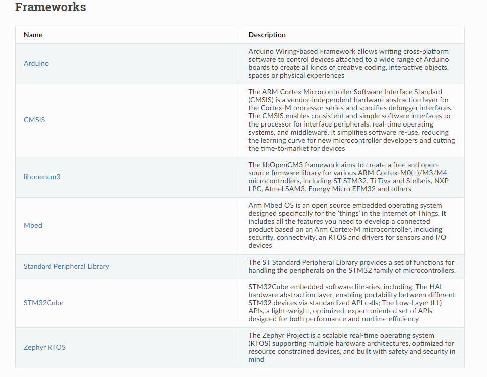

##### env : vscode + platformio + arduino(freamwork - based on ST-HAL) 

⚒️Append in **platformio.ini** to use **stlink** to download/debug :

```ini
upload_protocol = stlink
debug_tool = stlink
```



